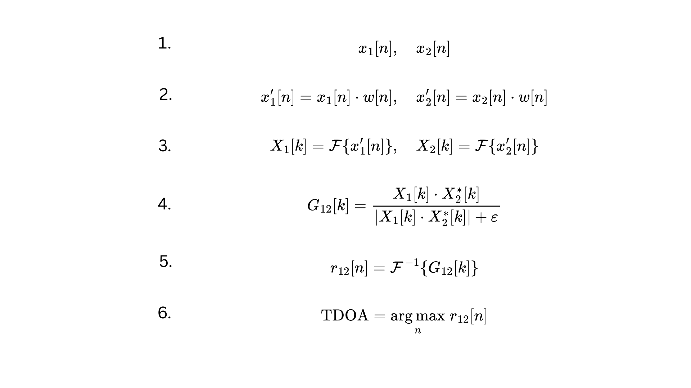

# GCC-PHAT - Generalized Cross Correlation with Phase Transformation 

**Generalized Cross Correlation with Phase Transformation (GCC PHAT)** is a mathematical process to calculate Time Delay of Arrival (TDOA) which is critical in Acoustic Localization or Sound Source Localization. 

## Time Delay Who? 

We all know that sound propagates itself as waves. Based on the distance, environment, and distractions, these sound waves arrive at different places at different times. If you have one microphone, we cannot calculate the time delay of audio arrival as there is no comparative delay with another microphone. Therefore, you need an array of two or more microphones located at specific geometric layout positions of your choice (based on your triangulation method or the geometry method to find out angle of sound source with time delay). Most of the time, we can imagine that the sound waves will arrive at the microphones at different times, regardless of how small the delay may be. Of course, the sound might arrive at both microphones at the same time. This difference in audio arrival at 2 or more microphones is called Time Delay of Arrival (TDOA). 

## GCC-PHAT in a nutshell 
In essence, GCC-PHAT is constructing a new correlation function based on the input signals (in this case audio signals). That function is normalized through phase weighting, henceforth the name PHAT. The argument which provides the maximum value in this new function will be taken as time delay between the microphones. The argument of the function is usually in samples and we will need to divide it by our sampling frequency to obtain seconds. 

## Process of GCC-PHAT for two microphones -

1. We have two audio samples (500 Hz)  with similar amplitude but just a difference in phase (with a delay of 5 samples).
   
 

2. To remove some noise, they will be processed in a windowing function.
   

3. Then, we will apply a Fast Fourier Transform, to change them from the time domain to frequency domain.
   

4. In the frequency domain, we will calculate the cross-power spectrum with phase transform of those two signals. Basically, this is the cross correlation in frequency domain.
   

5. Then, we apply an inverse fourier transform to change that cross power spectrum function in the frequency domain into the time domain. In time domain, the cross-power spectrum becomes cross correlation. 

6. Afterwards, we can take the argmax (the input value that can make the highest value) of the cross-correlation function as TDOA. Once we divide the argmax in samples by sampling frequency (Hz), we will obtain 

In mathematical Terms, it is like this - 

 

Feel free to reach out to me via [Linkedin](https://www.linkedin.com/in/minaungthu/)

